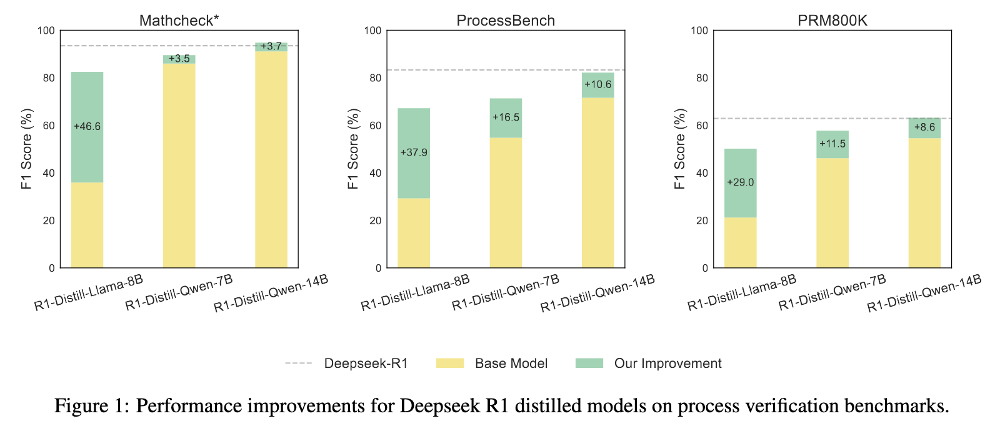
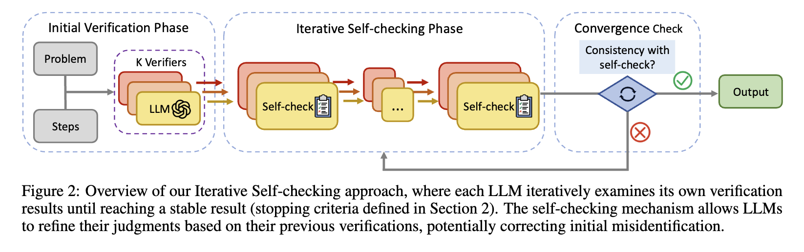

<div align="center">

# Iterative Self-checking for LLM Math Process Validation

<div>
🔍 Iterative Self-checking for LLM Math Process Validation 🎯
</div>
</div>
<div>
<br>

<div align="center">

[](https://arxiv.org/abs/your_paper)
[](https://github.com/your_repo)

</div>

</div>

## Overview


We introduce an iterative self-checking approach that significantly improves the verification accuracy of mathematical solutions for language models. Our method achieves remarkable performance with Deepseek R1 distilled models, enabling 7B/8B models to surpass all 70B/72B models and GPT-4o on ProcessBench. For example, with DeepSeek-R1-Distill-Qwen-7B, our method achieves **71.3%** accuracy on ProcessBench, while with DeepSeek-R1-Distill-Llama-8B it achieves **67.2%** accuracy. In the Iterative Self-checking method, each LLM iteratively checks its own identifications, and the final output is only produced when multiple LLMs demonstrate consistent self-checking over time.



## Getting Started 🎯 

### Installation
```bash
git clone https://github.com/jcguo123/Iterative-Self-checking-for-LLM-Math-Process-Validation.git
cd Iterative-Self-checking-for-LLM-Math-Process-Validation
pip install -r requirements.txt 
```

### Usage
For data in a JSON file. First, run the following code to generate the results for the first verification. 
```bash
python ./code/generation/initial_verification.py --model_path <MODEL_PATH> --dataset_path <DATASET_PATH> --output_dic <OUTPUT_DIR>
```
Then, run the following code for the self-checking rounds.
```bash
python ./code/generation/self_checking.py --model_path <MODEL_PATH> --output_dic <OUTPUT_DIRECTORY>
```
### Evaluation
To run our evaluation scripts, run:
```bash
python ./code/evaluation/evaluation.py --model <MODEL_NAME> --output_dic <OUTPUT_DIRECTORY>
```
### Performance
To evaluate the error detection capabilities, we choose three annotated mathematical step datasets, PRM800K, ProcessBench, and MathCheck. These benchmarks contain problems from GSM8K, MATH dataset, OlympiadBench, and Omni-MATH.
<div align="center">

| Model |  Mathcheck\* | ProcessBench | PRM800K |
| :---: | :---: | :---: | :---: |
| GPT-4o mini | 78.8 | 52.9 | 34.0 |
| + Iterative Self-checking | **84.8** | **58.2** | **39.0** |
| GPT-40 | 87.3 | 62.5 | 41.6 |
| + Iterative Self-checking | **91.8** | **69.1** | **51.6** |
| Llama 3.1 8B Instruct | 13.3 | 6.4 | 2.4 |
| + Iterative Self-checking | **60.2** | **35.5** | **22.1** |
| Mistral 7B Instruct v0.3 | 26.4 | 20.3 | 13.0 |
| + Iterative Self-checking | **37.4** | **22.5** | **13.3** |
| Deepseek-R1-Qwen-7B | 86.0 | 54.8 | 46.2 |
| + Iterative Self-checking | **89.5** | **71.3** | **57.7** |
| Deepseek-R1-Llama-8B | 35.9 | 29.3 | 21.2 |
| + Iterative Self-checking | **82.5** | **67.2** | **50.2** |
| Deepseek-R1-Qwen-14B | 91.1 | 71.6 | 54.6 |
| + Iterative Self-checking | **94.8** | **82.2** | **63.2** |
| Deepseek-R1 | 93.5 | 83.3 | 62.9 |
</div>
